# KMACTF 2025 lần 2
## Elecryptor
### Initial Analysis
* Ta được cung cấp 2 file, gồm file PE là `bh2.exe` và `Important_Note.txt`

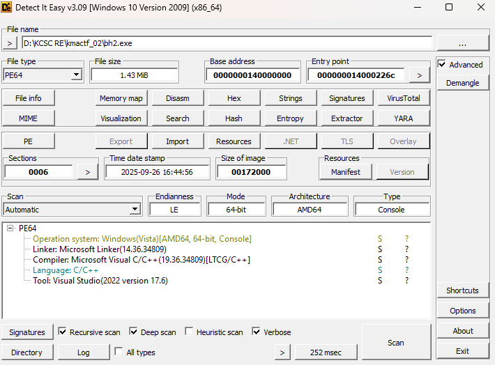

* Khi chạy chương trình, ta thấy rằng chương trình sẽ thực hiện tìm file `Important_Note.txt` trong thư mục `D:\`, nếu như không có thì prompt hiện lên như sau, phần nào đó ta có thể đoán được thuật toán encrypt

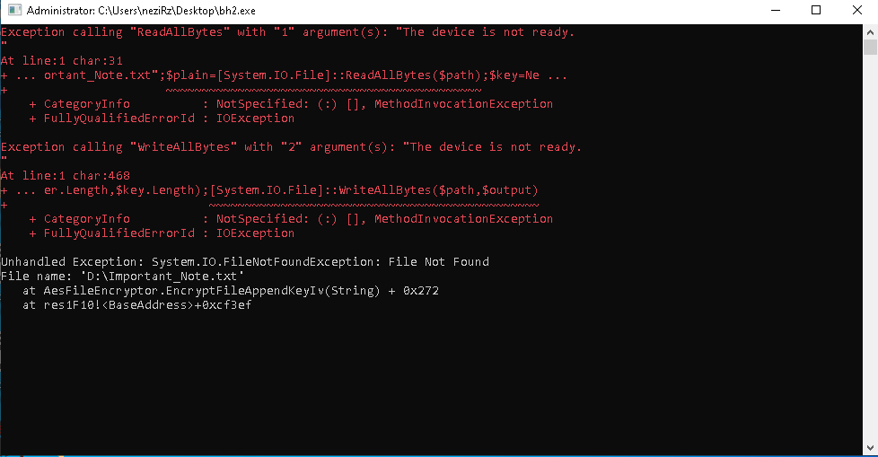
### Detailed Analysis

* Load vào IDA, ta tìm các ta tìm xem trước `Main` có thể gọi những gì thấy rằng tại `initterm` có hàm sau

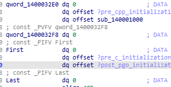
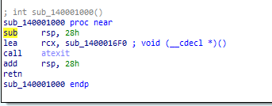

* Hàm này truyền tham số cho hàm `atexit` là `sub_1400016F0` nhằm mục đích khi chương trình thoát thì sẽ chạy vào `sub_1400016F0` (sẽ phân tích hàm này sau)

* Để phù hợp với luồng chương trình, ta sẽ tiếp tục phân tích `main`

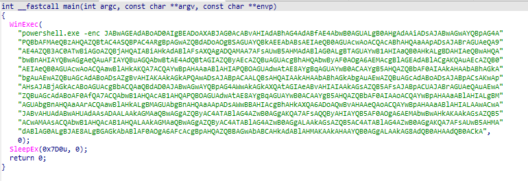

* Tại đây sẽ sử dụng WINAPI `WinExec` để thực hiện chạy command powershell đã bị base64 encoded kia, tiến hành decode command trên, ta được kết quả như sau
```powershell
$path="D:\Important_Note.txt";
$plain=[System.IO.File]::ReadAllBytes($path);
$key=New-Object byte[] 40;
[System.Security.Cryptography.RandomNumberGenerator]::Create().GetBytes($key);
$cipher=New-Object byte[] $plain.Length;
for($i=0; $i -lt $plain.Length; $i++){
    $cipher[$i]=$plain[$i]-bxor $key[$i%$key.Length]
};
$output=New-Object byte[] ($cipher.Length+$key.Length);
[Array]::Copy($cipher,0,$output,0,$cipher.Length);
[Array]::Copy($key,0,$output,$cipher.Length,$key.Length);
[System.IO.File]::WriteAllBytes($path,$output)
```
* Đoạn code powershell trên sẽ có nhiệm vụ đọc và encrypt file `Important_Note.txt` sử dụng xor, dùng thuật toán gen số ngẫu nhiên để gen ra 40 bytes làm key xor, cuối cùng thì append key xor vào cuối file

* Sau khi hết `main`, có vẻ như chương trình sẽ kết thúc tuy nhiên như đã đề cập bên trên thì ở `sub_140001000` đã set tham số hàm atexit là `sub_1400016F0`, tiếp đến ta sẽ phân tích hàm này


*  Hàm `sub_1400016F0` thực hiện các chức năng sau
   *  Kiểm tra nếu tiến tình hiện tại có đang chạy với quyền admin hay không, nếu có, vào hàm `sub_140001330`, thực hiện drop ra 1 con PE nữa trong resource bằng RC4 với key là `KMACTF_2025`, để decrypt phần header của file PE được drop, thực thi file này với cờ `CREATE_SUSPENDED`, sử dụng kỹ thuật `indirect syscall` để đọc thông tin tiến trình vừa được tạo, decrypt phần .text của file đổ đi và write lại vào trong mem của tiến trình
     
   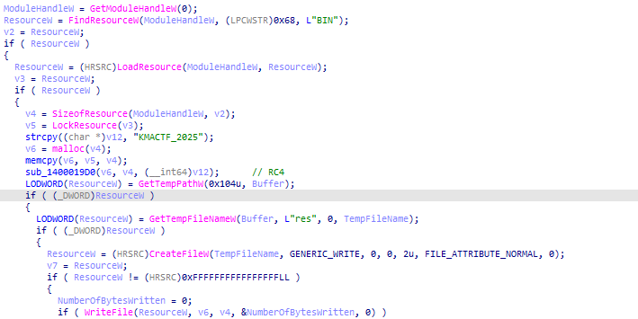
   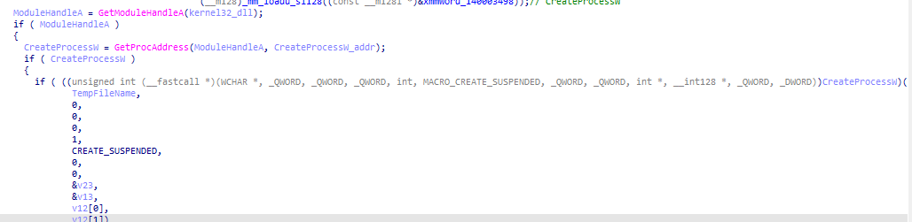
   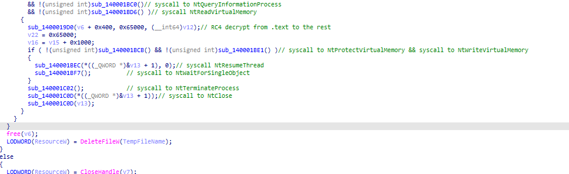
   
   * Nếu như không chạy với quyền admin, thực hiện `Process Tampering` thông qua `sub_140001020` bằng cách overwrite 2 thông tin trong PEB là `ImagePathName` và `CommandLine` của tiến trình thành `path\\to\\folder\\of\\explorer.exe` đồng thời sử dụng kĩ thuật UAC Bypass bằng `ICMLuaUtil` lấy từ WINAPI `CoGetObject` với moniker là ```Elevation:Administrator!new:{3E5FC7F9-9A51-4367-9063-A120244FBEC7}```, cuối cùng gọi `ShellExecuteW` để chạy lại tiến trình một lần nữa dưới trạng thái elevated
   
   
   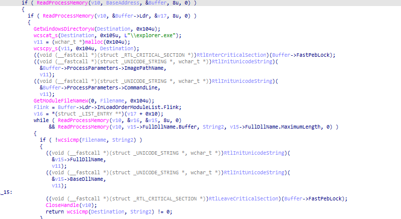
   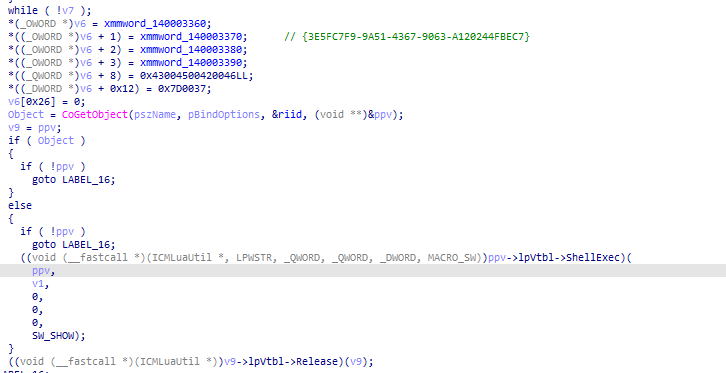

* Đến đây ta có thể suy ra được flow của chương trình là như sau
    * Check elevated status -> Dựa vào trạng thái trên để đưa ra quyết định là decrypt và execute file PE trong resource hoặc chạy lại process 1 lần nữa với elevated status

* Đồng thời tác giả cũng có đề cập là file được chạy bằng **CLICK CHUỘT**, nên ta có thể chắc chắn rằng tiến trình đang chạy với quyền thông thường, từ đó ta có flow encrypt như sau
  * XOR -> XOR -> Mã hóa ở PE thứ 2 

* Vậy để tiếp tục ta sẽ phải phân tích con PE được drop ra, kết quả nhận được là 1 file PE64

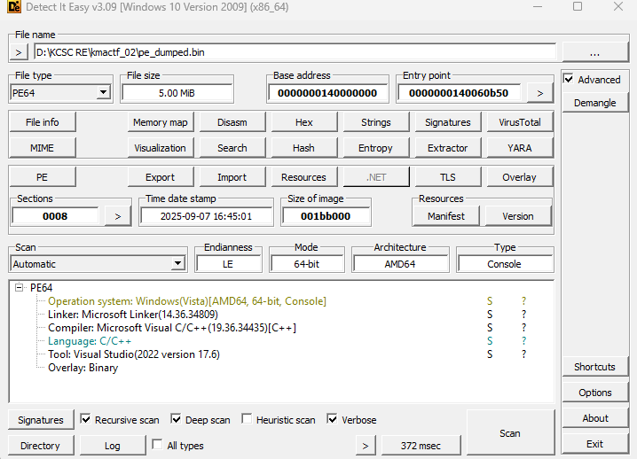
* Load vào IDA, ta thấy rằng đây là 1 file `.NET AOT`


* Đặc điểm chung của các file PE được build theo kiểu này là các symbol đều đã bị stripped hết

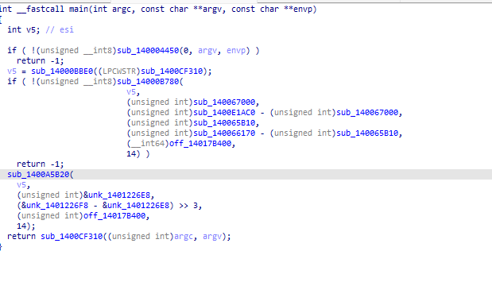

* Phân tích strings, ta có thể thấy phiên bản `.NET` cũng như là các thư viện và package được sử dụng

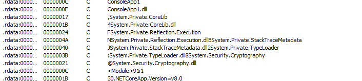

* Để việc phân tích trở nên dễ dàng hơn ta sẽ build 1 file `.NET AOT` khác có sử dụng các hàm trong các thư viện kể trên để lấy file `.pdb`, từ đó extract ra file `.SIG` và áp nó vào con PE cần phân tích, về cách thức chi tiết để làm được việc này, ta có thể tham khảo ở ```https://harfanglab.io/insidethelab/reverse-engineering-ida-pro-aot-net/```, sau khi làm xong sẽ được kết quả như bên dưới

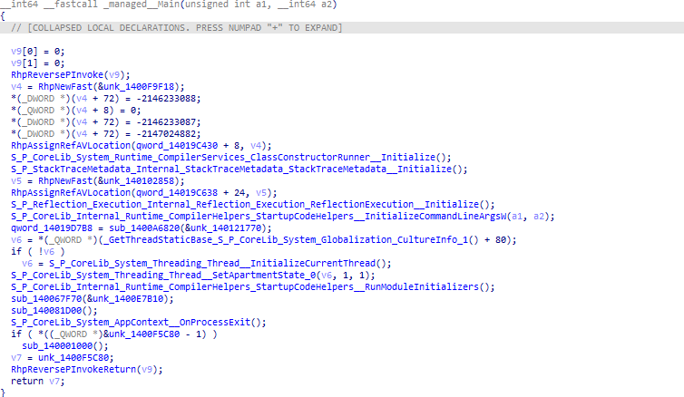

* Hàm thực hiện encrypt file
```CPP
__int64 __fastcall sub_140067F70(__int64 a1)
{
  // [COLLAPSED LOCAL DECLARATIONS. PRESS NUMPAD "+" TO EXPAND]

  v14 = 0;
  v15 = 0;
  if ( !(unsigned int)sub_140094470(a1) )
  {
    v12 = RhpNewFast(&unk_1400FD6F8);
    sub_1400949D0(v12, &unk_1400E8DF8, a1);
    RhpThrowEx(v12);
  }
  AllBytes = S_P_CoreLib_System_IO_File__ReadAllBytes(a1);
  v3 = RhpNewArray(&unk_14011C740, 32);
  v4 = RhpNewArray(&unk_14011C740, 16);
  v14 = v3 + 16;
  LODWORD(v15) = 32;
  System_Security_Cryptography_System_Security_Cryptography_RandomNumberGeneratorImplementation__FillSpan(&v14);
  v14 = v4 + 16;
  LODWORD(v15) = 16;
  System_Security_Cryptography_System_Security_Cryptography_RandomNumberGeneratorImplementation__FillSpan(&v14);
  v5 = RhpNewFast(&unk_140102BC8);
  System_Security_Cryptography_System_Security_Cryptography_Aes___ctor(v5);
  (*(void (__fastcall **)(__int64, __int64))(*(_QWORD *)v5 + 112LL))(v5, 256);
  (*(void (__fastcall **)(__int64, __int64))(*(_QWORD *)v5 + 64LL))(v5, 128);
  (*(void (__fastcall **)(__int64, __int64))(*(_QWORD *)v5 + 144LL))(v5, 1);
  (*(void (__fastcall **)(__int64, __int64))(*(_QWORD *)v5 + 160LL))(v5, 2);
  (*(void (__fastcall **)(__int64, __int64))(*(_QWORD *)v5 + 96LL))(v5, v3);
  (*(void (__fastcall **)(__int64, __int64))(*(_QWORD *)v5 + 80LL))(v5, v4);
  v13 = sub_1400B6660(v5);
  v6 = RhpNewFast(&unk_1400FD7D8);
  S_P_CoreLib_System_IO_MemoryStream___ctor_0(v6, 0);
  v7 = RhpNewFast(&unk_140102D98);
  System_Security_Cryptography_System_Security_Cryptography_CryptoStream___ctor_0(v7, v6, v13, 1, 0);
  System_Security_Cryptography_System_Security_Cryptography_CryptoStream__Write(
    v7,
    AllBytes,
    0,
    *(unsigned int *)(AllBytes + 8));
  System_Security_Cryptography_System_Security_Cryptography_CryptoStream__FlushFinalBlock(v7);
  v8 = S_P_CoreLib_System_IO_MemoryStream__ToArray(v6);
  unk_1400F7520(v7);
  unk_1400F7520(v6);
  if ( v13 )
    unk_1400F7520(v13);
  unk_1400F7520(v5);
  v9 = *(_DWORD *)(v8 + 8);
  v10 = RhpNewArray(&unk_14011C740, v9 + 48);
  S_P_CoreLib_System_Buffer__BlockCopy(v8, 0, v10, 0, v9);
  S_P_CoreLib_System_Buffer__BlockCopy(v3, 0, v10, v9, 32);
  S_P_CoreLib_System_Buffer__BlockCopy(v4, 0, v10, v9 + 32, 16);
  return sub_1400946F0(a1, v10);
}
```

* Ta có thể thấy rằng hàm này sẽ thực hiện encrypt file bằng AES-256 CBC, với key và IV được gen random và append vào cuối file (Data|32_bytes_key|16_bytes_IV)

* Đến đây ta có thể tổng kết lại flow encrypt sẽ là
  *  XOR -> XOR -> AES-256 CBC

* Để decrypt ta chỉ cẩn làm ngược lại quá trình trên là được, kết quả sau khi decrypt
```
Congratulations!!! Here is your Flag: N00b_3ncryp70r_w1th_3l3v47i0n_us3_ICMLu4U7il_C0M_In73rf4c3_4nd_.N37_407_^.^
Don't forget to add the Format Flag (KMACTF{...}) when submitting :3
```
**Flag:** `KMACTF{N00b_3ncryp70r_w1th_3l3v47i0n_us3_ICMLu4U7il_C0M_In73rf4c3_4nd_.N37_407_^.^}`

## simple
### Initial Analysis
* Ta được cung cấp 1 file PE64

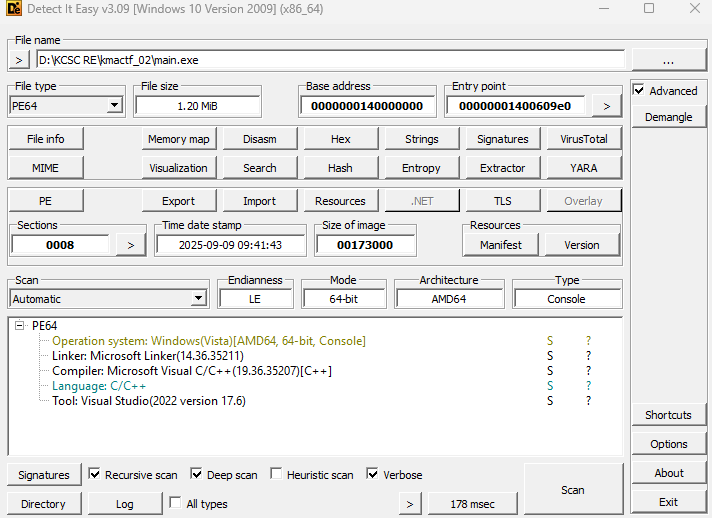

* Một flag checker điển hình nhận input từ `argv`

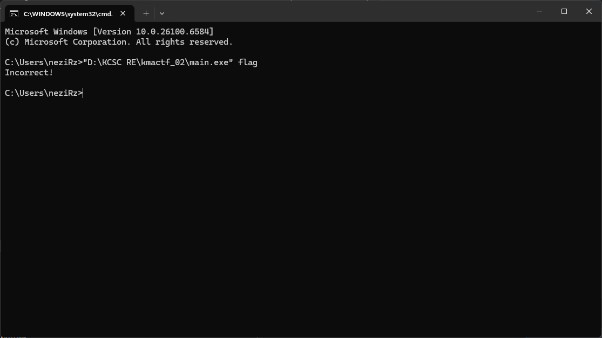

* Load vào IDA, ta có thể lập tức nhận ra đây là 1 binary được build sử dụng `.NET AOT`

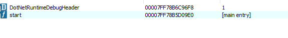

* Để giúp cho việc phân tích trở nên tiện lợi hơn, ta có thể áp dụng cách sử dụng file `SIG` như đã đề cập ở bài trên

## Detailed Analysis

* Ta có thể thấy rẳng ở trước `main` có sử dụng 1 method khởi tạo

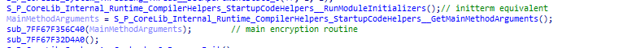
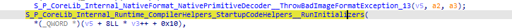

* Tiến hành debug, ta thấy rằng có hàm sau được gọi

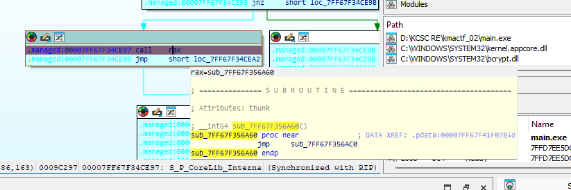
```cpp
__int64 sub_7FF67F356AC0()
{
  // [COLLAPSED LOCAL DECLARATIONS. PRESS NUMPAD "+" TO EXPAND]

  if ( (unsigned int)S_P_CoreLib_System_Threading_Thread__Yield_0() )
  {
    result = *(_QWORD *)(qword_7FF67F409490 + 8);
    v2 = result;
    v3 = *(unsigned int *)(result + 8);
    if ( (unsigned int)v3 > 0x13 )
    {
      v2 = *(unsigned __int8 *)(result + 0x23);
      v0 = *(_QWORD *)(qword_7FF67F409490 + 8);
      if ( (unsigned int)v3 > 0x37 )
      {
        *(_BYTE *)(result + 0x23) = *(_BYTE *)(result + 0x47);
        v0 = result;
        *(_BYTE *)(result + 0x47) = v2;
        v2 = result;
        if ( (unsigned int)v3 > 0xDE )
        {
          v4 = *(_BYTE *)(result + 0xEE);
          *(_BYTE *)(result + 0xEE) = *(_BYTE *)(result + 0xBD);
          *(_BYTE *)(result + 0xBD) = v4;
          return result;
        }
      }
    }
LABEL_9:
    S_P_CoreLib_Internal_NativeFormat_NativePrimitiveDecoder__ThrowBadImageFormatException_13(v2, v3, v0);
  }
  result = *(_QWORD *)(qword_7FF67F409490 + 8);
  v2 = result;
  v3 = *(unsigned int *)(result + 8);
  if ( (unsigned int)v3 <= 0xCA )
    goto LABEL_9;
  v2 = *(unsigned __int8 *)(result + 0xDA);
  v0 = *(_QWORD *)(qword_7FF67F409490 + 8);
  if ( (unsigned int)v3 <= 0xFE )
    goto LABEL_9;
  *(_BYTE *)(result + 0xDA) = *(_BYTE *)(result + 0x10E);
  *(_BYTE *)(result + 0x10E) = v2;
  return result;
}
```

* Hàm này thực hiện check debugger bằng WINAPI `IsDebuggerPresent`, tùy thuộc vào kết quả thì sẽ thực hiện biến đổi lên 1 data structure có format như sau


* Trong quá trình debug khi ta nhấn đúp vào các biến chắc chăn sẽ gặp một số data structure như này, đây là một struct có format như sau (ptr|size_of_data|6_bytes_padding|data)

* Có thể đống data này sẽ được sử dụng trong quá trình encrypt, cần phải lưu ý, tiếp đến là phân tích hàm thực hiện xử lí và encrypt input `sub_7FF67F356C40`

```cpp
__int64 __fastcall sub_7FF67F356C40(__int64 a1)
{
  // [COLLAPSED LOCAL DECLARATIONS. PRESS NUMPAD "+" TO EXPAND]

  if ( *(_DWORD *)(a1 + 8) == 1 )               // args check
  {
    v7 = RhpNewArray(&qword_7FF67F3A3B58, 0x50);
    memcpy((void *)(v7 + 0x10), &unk_7FF67F3CA980, 0x50u);// ciphertext
    v8 = RhpNewArray(&qword_7FF67F3A3B58, 0x10);
    *(_OWORD *)(v8 + 0x10) = xmmword_7FF67F3CA970;// 128 bits key
    if ( *(&qword_7FF67F385DF8 + 0xFFFFFFFF) )
      sub_7FF67F2B13DC();
    Bytes = S_P_CoreLib_System_Text_UTF8Encoding_UTF8EncodingSealed__GetBytes(
              *(_QWORD *)(qword_7FF67F409320 + 8),
              *(_QWORD *)(a1 + 0x10));
    v10 = PKCS7_padding(Bytes, 0x10);
    v11 = RhpNewFast(&unk_7FF67F390F38);
    sub_7FF67F356E20(v11, v8);                  // key expansion routine
    v12 = *(_DWORD *)(v10 + 8);
    v13 = RhpNewArray(&qword_7FF67F3A3B58, v12);
    for ( i = 0; (int)v12 > i; i += 0x10 )      // encrypt 16-bytes block of data per iteration
    {
      v15 = (int *)RhpNewArray(&qword_7FF67F3A3B58, 0x10);
      S_P_CoreLib_System_Buffer__BlockCopy(v10, i, (_DWORD)v15, 0, 0x10);
      v16 = sub_7FF67F357A00(v11, v15);
      S_P_CoreLib_System_Buffer__BlockCopy(v16, 0, v13, i, 0x10);
    }
    if ( *(_DWORD *)(v13 + 8) != 0x50 )
      return sub_7FF67F317190((__int64)&off_7FF67F37C988);
    v17 = 1;
    for ( j = 0; j < 0x50; ++j )
    {
      if ( *(_BYTE *)(v13 + (unsigned int)j + 0x10) != *(_BYTE *)(v7 + (unsigned int)j + 0x10) )
        v17 = 0;
    }
    if ( v17 )
      return sub_7FF67F317190((__int64)&off_7FF67F37ADE0);// Correct
    else
      return sub_7FF67F317190((__int64)&off_7FF67F37C988);// Incorrect
  }
  else
  {
    v2 = sub_7FF67F31B800();
    if ( !*(_DWORD *)(v2 + 8) )
      S_P_CoreLib_Internal_NativeFormat_NativePrimitiveDecoder__ThrowBadImageFormatException_13(v4, v3, v5);
    return sub_7FF67F3171B0((__int64)&off_7FF67F382FC0, *(_QWORD *)(v2 + 0x10));
  }
}
```
* Hàm này trước hết kiểm tra số argc được cung cấp, nếu như là 1 (ngoại trừ path và tên chương trình) thì sẽ tiến hành convert argv từ UTF-16LE thành UTF-8, pad input nếu như độ dài input không phải là bội của 16, sử dụng encrypt khối tựa AES để encrypt input với 1 key 16 bytes, tuy nhiên khi vào bên trong hàm sinh khóa, ta có thể thấy biến thể này sử dụng S-Box custom (chính là 0x100 bytes mà ta gặp lúc đầu)

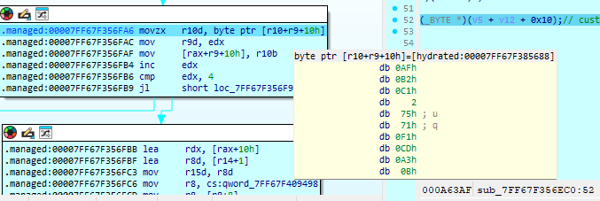

* Đến đây thì luồng đã quá rõ ràng, chương trình sẽ thực hiện encrypt AES-128 ECB lên input sử dụng SBOX custom, vậy để decrypt ta sẽ phải dump SBOX ở bên trong mem (sau khi đã bypass anti debug), tìm inv_SBOX, về thuật toán thì ta có thể tìm ở trên mạng, thay lại SBOXes và sử dụng, kết quả sau khi decrypt là như sau

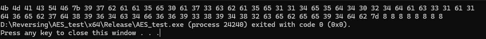
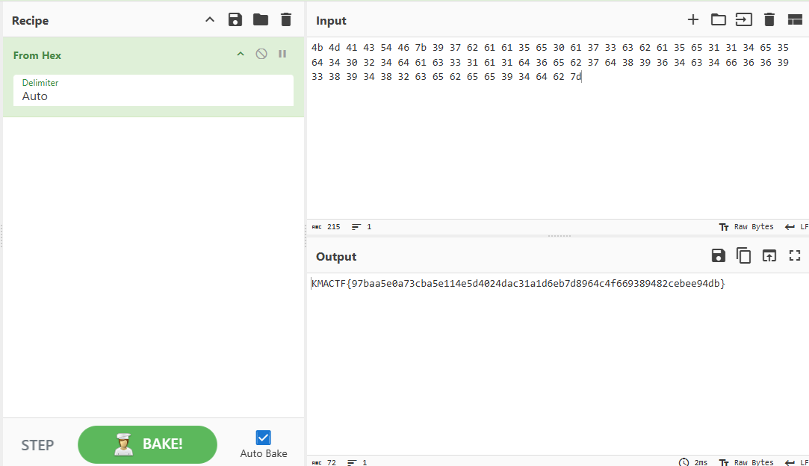

**Flag:** `KMACTF{97baa5e0a73cba5e114e5d4024dac31a1d6eb7d8964c4f669389482cebee94db}`

## chall2
### Initial Analysis
* Ta được cung cấp 1 file PE32

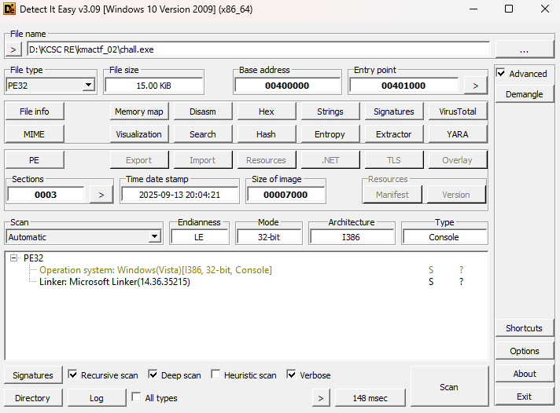
### Detailed Analysis
* Ta có thể thấy rằng chương trình sử dụng kĩ thuật `HeavenGate` sử dụng instruction `call far`

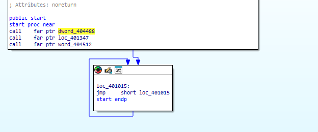

* Đây là một kĩ thuật anti debug khá hiệu quả vì nó chặn được hết tất cả các debugger user-mode, nếu như debug bằng IDA, debugger sẽ không theo được và ngay lập tức raise exception
 
* Giới thiệu một chút về kĩ thuật này, thì `HeavenGate` thường được sử dụng khi các tiến trình 32bit (Windows On Windows 64, từ sau sẽ gọi là WOW64) cần sử dụng đến các APIs, interfaces, libraries mà chỉ bên 64 bit mới có, một ví dụ điển hình chính là cơ chế hoạt động của các hàm native (ntdll.dll) sử dụng syscall, mà bởi bản thân các tiến trình WOW64 lại không thể gọi syscall, thì lúc này sẽ phải sử dụng một cơ chế của Windows là `WoW64Transition`, cơ chế này sẽ có nhiệm vụ đổi context thực thi sang 64 bit, thực hiện các setup cần thiết để gọi syscall cho hàm Nt cụ thể, sau đó về lại context 32 bit ban đầu, dưới đây là ví dụ cho WINAPI `ntdll_NtQueryInformationProcess` bên trong 1 tiến trình `WOW64`

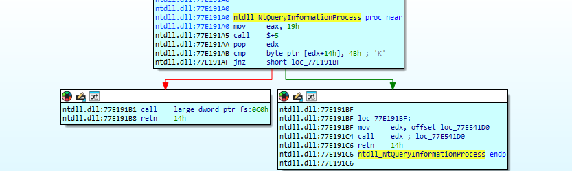
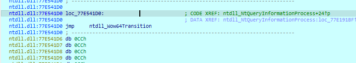
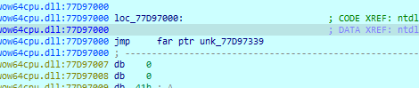

* Về cơ chế hoạt động thì `HeavenGate` sẽ thay đổi thanh ghi `code segment` `CS`. Đối với tiến trình `WOW64` sẽ có value là `0x23` và x64 là `0x33`. Dấu hiệu để nhận biết 1 binary có sử dung kĩ thuật `HeavenGate` sẽ là các instruction sẽ có chữ `far`, ví dụ như `call far`, `jmp far`, `retfar`,....

* Quay lại phân tích, khi ta nhấn đúp vào địa chỉ call far của các instruction thì có vẻ là không thấy code hoặc là code rác

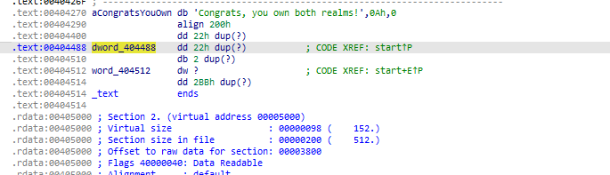 

* Lí do cho điều này là bởi giá trị của `code segment` trong instruction `call far` làm IDA decompile sai

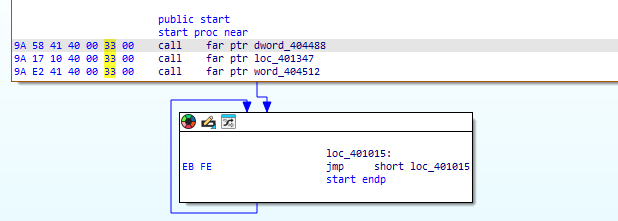

* Nhìn opcode của instruction trên ta có thể thấy `9A` sẽ là opcode cho `call far`, 4 bytes tiếp theo sẽ là địa chỉ tương đối với IP và 2 bytes còn lại là value `code segment` cần phải thay đổi
* Vậy ý tưởng để làm sẽ là ta dump toàn bộ segment `.text` của binary ra, load vào IDA dưới dạng 64bit, patch lại các các instruction `call far`, `retfar`  thành các instruction `call`, `ret`,... thông thường và coi file dump như là shellcode, ta có thể sửa lại như sau

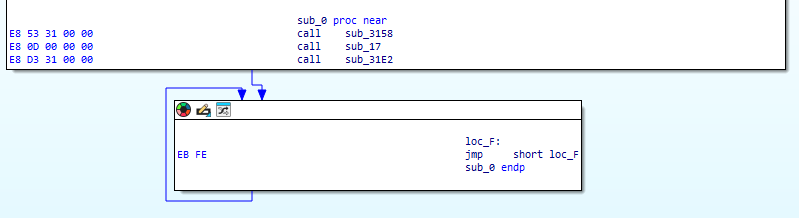
* Cuối cùng là code 1 shellcode loader và load shellcode này là ta có thể debug được như bình thường

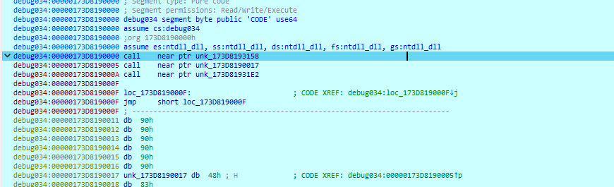
* Hàm xử lí input có format như sau
```asm
debug034:00000173D8190017 sub     rsp, 50h
debug034:00000173D819001B mov     rax, gs:60h
debug034:00000173D8190024 mov     rax, [rax+20h]
debug034:00000173D8190028 mov     rcx, [rax+20h]
debug034:00000173D819002C xor     edx, edx
debug034:00000173D819002E xor     r8d, r8d
debug034:00000173D8190031 xor     r9d, r9d
debug034:00000173D8190034 lea     rax, [rsp+10h]
debug034:00000173D8190039 mov     [rsp+20h], rax
debug034:00000173D819003E lea     rax, [rsp]
debug034:00000173D8190042 mov     [rsp+28h], rax
debug034:00000173D8190047 mov     dword ptr [rsp+30h], 8
debug034:00000173D819004F mov     qword ptr [rsp+38h], 0
debug034:00000173D8190058 mov     qword ptr [rsp+40h], 0
debug034:00000173D8190061 mov     r10, rcx
debug034:00000173D8190064 mov     eax, 6
debug034:00000173D8190069 test    eax, eax
debug034:00000173D819006B jz      short near ptr loc_173D8190070+2
debug034:00000173D819006D jmp     short loc_173D8190070
debug034:00000173D819006D ; ---------------------------------------------------------------------------
debug034:00000173D819006F db 0C3h
debug034:00000173D8190070 ; ---------------------------------------------------------------------------
debug034:00000173D8190070
debug034:00000173D8190070 loc_173D8190070:                        ; CODE XREF: debug034:00000173D819006D↑j
debug034:00000173D8190070                                         ; debug034:00000173D819006B↑j
debug034:00000173D8190070 sub     rsp, 8
debug034:00000173D8190074 syscall                                 ; Low latency system call
debug034:00000173D8190076 add     rsp, 8
debug034:00000173D819007A mov     ax, [rsp]
debug034:00000173D819007E movzx   eax, ax
debug034:00000173D8190081 mov     bx, [rsp+2]
debug034:00000173D8190086 mov     [rsp+40h], bx
debug034:00000173D819008B movd    xmm0, eax
debug034:00000173D819008F pshufd  xmm0, xmm0, 0
debug034:00000173D8190094 movdqa  xmm1, xmm0
debug034:00000173D8190098 pslldq  xmm1, 2
debug034:00000173D819009D pxor    xmm0, xmm1
debug034:00000173D81900A1 pslldq  xmm1, 4
debug034:00000173D81900A6 pxor    xmm0, xmm1
debug034:00000173D81900AA mov     ebx, 9E3779B9h
debug034:00000173D81900AF movd    xmm2, ebx
debug034:00000173D81900B3 pshufd  xmm2, xmm2, 0
debug034:00000173D81900B8 mov     ebx, 7F4A7C15h
debug034:00000173D81900BD movd    xmm3, ebx
debug034:00000173D81900C1 pshufd  xmm3, xmm3, 0
debug034:00000173D81900C6 movdqa  xmm5, xmm0
debug034:00000173D81900CA pxor    xmm5, xmm2
debug034:00000173D81900CE movdqa  xmm6, xmm0
debug034:00000173D81900D2 psrldq  xmm6, 1
debug034:00000173D81900D7 pxor    xmm6, xmm3
debug034:00000173D81900DB movdqa  xmm7, xmm5
debug034:00000173D81900DF pxor    xmm7, xmm6
debug034:00000173D81900E3 movdqa  xmm4, xmm6
debug034:00000173D81900E7 aesimc  xmm4, xmm4
debug034:00000173D81900EC mov     dx, ax
debug034:00000173D81900EF rol     dx, 9
debug034:00000173D81900F3 movd    ebx, xmm7
debug034:00000173D81900F7 and     ebx, 0FFFFh
debug034:00000173D81900FD test    ebx, ebx
debug034:00000173D81900FF jz      short near ptr loc_173D8190101+1
debug034:00000173D8190101
debug034:00000173D8190101 loc_173D8190101:                        ; CODE XREF: debug034:00000173D81900FF↑j
debug034:00000173D8190101 jmp     short $+2
debug034:00000173D8190103 ; ---------------------------------------------------------------------------
debug034:00000173D8190103
debug034:00000173D8190103 loc_173D8190103:                        ; CODE XREF: debug034:loc_173D8190101↑j
debug034:00000173D8190103 xor     ax, dx
debug034:00000173D8190106 xor     ax, bx
debug034:00000173D8190109 imul    ax, 7
debug034:00000173D819010D movzx   eax, ax
debug034:00000173D8190110 and     eax, 1FFh
debug034:00000173D8190115 add     eax, 100h
debug034:00000173D819011A lea     rdi, unk_173D819017B
debug034:00000173D8190121 lea     rdi, [rdi+rax]
debug034:00000173D8190125 mov     rsi, rdi
debug034:00000173D8190128 add     rsi, 150h
debug034:00000173D819012F mov     ecx, 16h
debug034:00000173D8190134
debug034:00000173D8190134 loc_173D8190134:                        ; CODE XREF: debug034:00000173D819014E↓j
debug034:00000173D8190134 movdqu  xmm1, xmmword ptr [rsi]
debug034:00000173D8190138 pxor    xmm1, xmm7
debug034:00000173D819013C aesdec  xmm1, xmm4
debug034:00000173D8190141 aesdeclast xmm1, xmm5
debug034:00000173D8190146 movdqu  xmmword ptr [rsi], xmm1
debug034:00000173D819014A sub     rsi, 10h
debug034:00000173D819014E loop    loc_173D8190134
debug034:00000173D8190150 mov     rsi, rdi
debug034:00000173D8190153 add     rsi, 15Fh
debug034:00000173D819015A mov     ecx, 160h
debug034:00000173D819015F xor     rdx, rdx
debug034:00000173D8190162
debug034:00000173D8190162 loc_173D8190162:                        ; CODE XREF: debug034:00000173D8190177↓j
debug034:00000173D8190162 mov     al, [rsi]
debug034:00000173D8190164 mov     ebx, edx
debug034:00000173D8190166 and     ebx, 1
debug034:00000173D8190169 mov     bl, [rsp+rbx+40h]
debug034:00000173D819016D xor     al, bl
debug034:00000173D819016F mov     [rsi], al
debug034:00000173D8190171 dec     rsi
debug034:00000173D8190174 inc     rdx
debug034:00000173D8190177 loop    loc_173D8190162
debug034:00000173D8190179 jmp     rdi
```
* Đoạn code này sẽ có nhiệm vụ đọc input 4 ký tự của user từ console sử dụng syscall của `NtReadFile`, sau syscall, input sẽ được đọc từ stack, 2 ký tự đầu được lưu vào `AX`, 2 ký tự còn lại được lưu vào `BX`, sử dụng các instruction `aesimc`, `aesdec`, `aesdeclast`  và xor để decrypt code và tính toán địa chỉ jump đến cho đoạn jmp cuối cùng nếu như sai thì chương trình sẽ crash. Nhìn qua thì có lẽ ta sẽ phải brute tận 4 bytes, tuy nhiên nếu để ý kỹ ta sẽ thấy được rằng `AX` sẽ quy định key cho AES và địa chỉ jump đến, còn `BX` sẽ là key để xor, điều này có nghĩa là chỉ có `AX` mới cần phải brute còn `BX` ta sẽ lấy plaintext xor lại nếu như ra ascii dạng lặp lại (eg: `ababab`, `aaaaaa`,....) thì sẽ là input chuẩn

* Vậy vấn đề bây giờ sẽ là plaintext, may thay ta có thể test input là format flag, với input đầu tiên là `KMAC`, ta thấy rằng code sau khi decrypt có đoạn mở đầu y hệt đoạn code check ban đầu

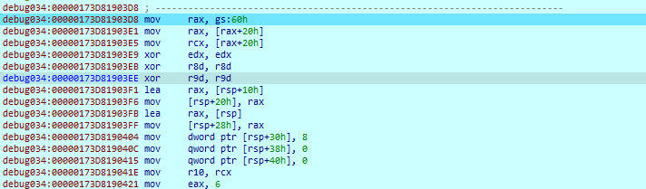

* Để giải ta sẽ build lại đoạn code ASM trên (vì code tương đối ngắn nên việc build lại cũng không quá khó khăn, hoặc ta có thể sử dụng các loại tool emulate để mô phỏng lại), bruteforce 2 kí tự đầu, xor đoạn code sau khi decrypt với byte code của instruction đầu tiên, nếu ra string ascii có dạng lặp lại thì đó sẽ là các kí tự đúng tuy nhiên có một điều phải lưu ý rằng tuy đoạn code sau khi decrypt ra không khác nhau đoạn đầu nhưng ở đoạn giữa sẽ khác đôi chút nhưng không quá nhiều, ta phải sửa script tương ứng (script brute sẽ được để ở 1 file riêng bởi nó khá dài)

* Kết quả sau các lần brute là như sau 
```
KMAC
TF{3
2bit
_hea
ven_
cras
hed_
in??
????
????
??li
sh_s
ysca
lls}
```
* Với check cuối cùng là compare string nhập vào với `to_64bit_hel`, ta được kết quả là 
`KMACTF{32bit_heaven_crashed_in????????????lish_syscalls}to_64bit_hel`
* Ghép nốt phần bên ngoài vào bên trong chỗ `????????????` ta được flag là 


**Flag:** `KMACTF{32bit_heaven_crashed_into_64bit_hellish_syscalls}`


